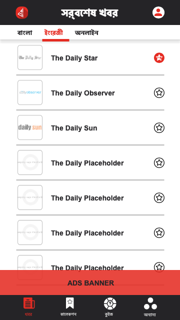

# Barta Newspaper Reading App

An Android application for reading Bangladeshi newspapers, built with Java and XML. The app uses Retrofit for network operations and fetches news data scraped by Python scripts. It follows the MVVM (Model-View-ViewModel) architecture for clean and maintainable code.


[![Contributors][contributors-shield]][contributors-url]
[![Forks][forks-shield]][forks-url]
[![Stargazers][stars-shield]][stars-url]
[![Issues][issues-shield]][issues-url]
[![MIT License][license-shield]][license-url]
[![LinkedIn][linkedin-shield]][linkedin-url]


---


<!-- PROJECT LOGO -->
<br />
<p align="center">
  <a href="https://github.com/khalid-syfullah/BartaApp">
    
  </a>
 

  <h3 align="center">Barta</h3>

  <p align="center">
   Barta Newspaper Reading App for Android
  </p>
</p>

## Table of Contents
1. [Description](#description)
2. [Features](#features)
3. [Architecture](#architecture)
4. [Technologies Used](#technologies-used)
5. [Installation](#installation)
6. [Usage](#usage)
7. [Project Structure](#project-structure)
8. [API Details](#api-details)
9. [Contributing](#contributing)
10. [License](#license)
11. [Contact](#contact)

---

## Description

Barta is an Android app designed to provide users with up-to-date news from popular Bangladeshi newspapers. The news content is collected by Python web scraping scripts running on a server, which serve the data via a REST API. The app uses Retrofit to consume this API and display the news in a clean, user-friendly interface.

The app architecture follows MVVM principles, separating UI, data, and business logic to make the app modular, testable, and scalable.


<br />
<p align="center">
  <br>
  <br>
  <br>
  <br>


  
  
  
  <br>
  <br>
  
  
  
 
  <br>
  <br>
  <br>
  <br>


</p>

---

## Features

- Browse latest news articles from multiple Bangladeshi newspapers.
- Categorized news sections for easier navigation.
- Pull-to-refresh for updated news.
- Offline caching of articles.
- Search functionality to find news by keywords.
- Smooth, responsive UI using RecyclerView.
- Follows MVVM architecture for maintainability.

---

## Architecture

- **Model:** Data classes representing news articles.
- **View:** XML layouts and Activities/Fragments for displaying UI.
- **ViewModel:** Handles business logic and LiveData to update UI reactively.
- **Repository:** Manages data operations and communicates with the API.
- **Retrofit:** Network layer for fetching news JSON from the Python backend.

---

## Technologies Used

- **Java** - Primary programming language for the Android app.
- **XML** - For UI design.
- **Retrofit** - Network library to handle REST API calls.
- **LiveData & ViewModel** - Android Architecture Components for MVVM.
- **Python** - Backend scraping scripts for collecting newspaper data.
- **REST API** - Serves scraped news data to the app.
- **RecyclerView** - Displays lists of news articles.

---


## Installation

1. Clone this repository:
   ```bash
   git clone https://github.com/Khalid-Syfullah/BartaApp.git
   ```
2. Open the project in Android Studio.
3. Ensure you have an Android device or emulator running API level 21 or higher.
4. Configure the backend API URL in the `RetrofitClient` class.
5. Build and run the app.

---

## Usage

- Launch the app on your device/emulator.
- Browse through various categories to view news articles.
- Tap on an article to read the full content.
- Use the search bar to find specific news.
- Pull down to refresh the news feed.

---

## Project Structure

```
📦 app
 ┣ 📂 src
 ┃ ┣ 📂 main
 ┃ ┃ ┣ 📂 java/com/example/barta
 ┃ ┃ ┃ ┣ 📜 activities
 ┃ ┃ ┃ ┣ 📜 adapters
 ┃ ┃ ┃ ┣ 📜 models
 ┃ ┃ ┃ ┣ 📜 network
 ┃ ┃ ┃ ┣ 📜 repository
 ┃ ┃ ┃ ┗ 📜 viewmodels
 ┃ ┃ ┣ 📂 res
 ┃ ┃ ┃ ┣ 📂 layout
 ┃ ┃ ┃ ┣ 📂 drawable
 ┃ ┃ ┃ ┗ 📂 values
 ┃ ┃ ┗ 📜 AndroidManifest.xml
```

---

## API Details

The app consumes data from a Python backend API which scrapes news websites. The API provides endpoints like:

- `GET /news` - Fetch latest news articles.
- `GET /news/{category}` - Fetch news by category.
- `GET /news/search?q={query}` - Search news articles by keyword.

---

## Contributing

Contributions are welcome! Please follow these steps:

1. Fork the project.
2. Create a new branch (`git checkout -b feature/your-feature`).
3. Commit your changes (`git commit -m 'Add your feature'`).
4. Push to your branch (`git push origin feature/your-feature`).
5. Open a pull request.

---

## License

This project is licensed under the MIT License - see the [LICENSE](LICENSE) file for details.

---


<!-- CONTACT -->
## Contact

Khalid Syfullah - [@khalid_syfullah](https://twitter.com/khalid_syfullah) - khalidsyfullah@gmail.com

Project Link: [https://github.com/khalid-syfullah/BartaApp](https://github.com/khalid-syfullah/BartaApp)

Thank you for checking out Barta! Stay informed with the latest Bangladeshi news, all in your pocket.


<!-- ACKNOWLEDGEMENTS -->
## Acknowledgements
* [Choose an Open Source License](https://choosealicense.com)
* [GitHub Pages](https://pages.github.com)

[contributors-shield]: https://img.shields.io/static/v1?label=Contributors&message=2&color=red
[contributors-url]: https://github.com/khalid-syfullah/bartaapp/graphs/contributors
[forks-shield]: https://img.shields.io/static/v1?label=Forks&message=1&color=green
[forks-url]: https://github.com/khalid-syfullah/bartaapp/network/members
[stars-shield]: https://img.shields.io/static/v1?label=Stars&message=1&color=blue
[stars-url]: https://github.com/khalid-syfullah/bartaapp/stargazers
[issues-shield]: https://img.shields.io/static/v1?label=Issues&message=0&color=yellow
[issues-url]: https://github.com/khalid-syfullah/bartaapp/issues
[license-shield]: https://img.shields.io/static/v1?label=Licenses&message=0&color=purple
[license-url]: https://github.com/khalid-syfullah/bartaapp/blob/master/LICENSE.txt
[linkedin-shield]: https://img.shields.io/static/v1?label=LinkedIn&message=Khalid-Syfullah&logo=linkedin
[linkedin-url]: https://bd.linkedin.com/in/khalid-syfullah
[product-screenshot]: https://github.com/Khalid-Syfullah/bartaapp/UI/logo.png
